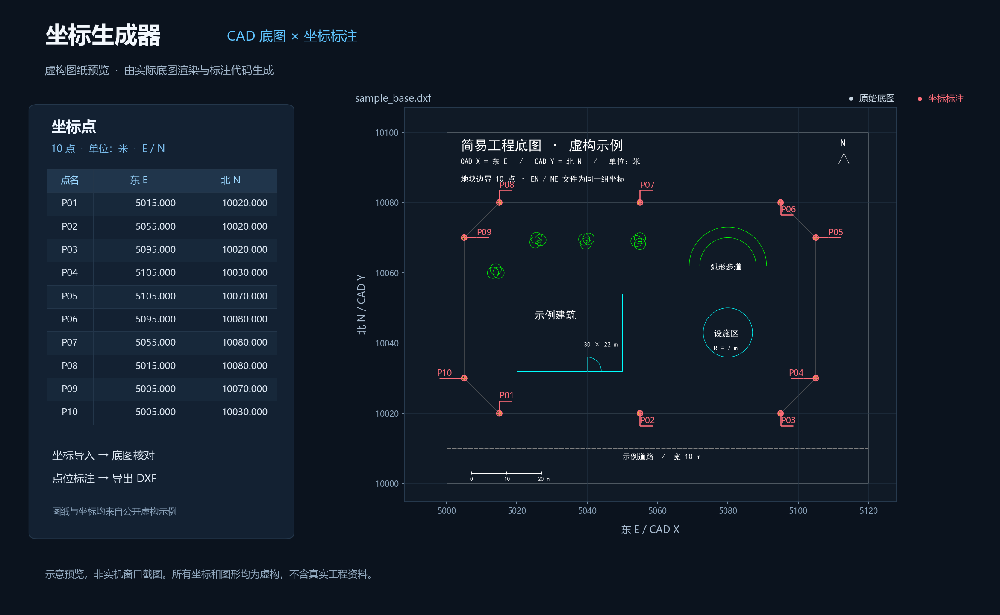

# 坐标生成器 · CAD Coordinate Tool

[](https://github.com/cc519979682-cyber/cad-coordinate-tool/actions/workflows/windows.yml)
[](LICENSE)

面向施工测量的中文桌面工具：在 CAD 当前图纸中按道路取点、摆放坐标标注，把坐标实时回传到点表；也可以导入坐标文件，在 CAD 底图上预览并导出带标注的 DXF。

**[下载 Windows 版](https://github.com/cc519979682-cyber/cad-coordinate-tool/releases/latest)** · [详细操作说明](docs/USAGE.md) · [开发与测试](CONTRIBUTING.md) · [问题反馈](https://github.com/cc519979682-cyber/cad-coordinate-tool/issues)



> 图纸与坐标均为仓库内的虚构示例。当前公开版本为 v22.8.0，软件界面显示 v22.8。

## 能做什么

- **在当前 CAD 图纸取点**：选择已经打开的图纸，捕捉点位，移动并确认三行坐标标注，回传点名、东 E、北 N、高程 Z 和标注位置。
- **按道路连续工作**：`N` 换路，新道路从 01 编号；同一道路接着编号。全部退出后输入 `ZB`，填写道路名称，再继续取点。
- **坐标文件识别**：读取 TXT、CSV、Excel 或粘贴文本，支持点名、E/N、可选高程。可结合表头和底图范围判断 E/N 顺序，歧义时由使用者选择。
- **图纸与坐标一起查看**：DXF 底图、DWG 转换预览、缩放平移、点表与点位联动、底图显示开关。默认不把各道路坐标连成一条线。
- **编辑、保存与恢复**：坐标增删改、E/N 互换、撤销、项目保存，以及取点日志恢复。
- **导出**：坐标表、带标注 DXF、绘图 LSP；保留已确认的道路分组与标注位置。

## 快速使用

### Windows 下载包

1. 从 [Releases](https://github.com/cc519979682-cyber/cad-coordinate-tool/releases/latest) 下载 `cad-coordinate-tool-v22.8.0-windows-x64.zip`。
2. **完整解压**，保留 EXE、`_internal` 和许可证文件夹，双击 `坐标生成器v22.8.exe`。不需要自行安装 Python。
3. 点击右上角 **示例图**，即可用虚构数据体验底图和坐标叠加。
4. 需要实际取点时，在 AutoCAD 打开图纸，再点击软件顶部 **CAD 取点**。

### 道路取点的常用操作

| 所在阶段 | 操作 | 结果 |
|---|---|---|
| 等待点位 | 点击点位，再摆放并确认标注 | 加入一个点 |
| 等待点位 | `Enter` | 结束本条道路，进入道路菜单 |
| 等待点位或道路菜单 | `N`，输入道路名称 | 切换道路 |
| 道路菜单 | `C` | 返回当前道路继续取点 |
| 等待点位 | `U` | 撤销当前道路本轮新取的点 |
| 等待点位或道路菜单 | `Q` 或 `Esc` | 结束全部取点，保留已确认的点 |
| 已退出取点，软件和原 CAD 图纸仍开着 | `ZB`，输入道路名称 | 续接取点；已有道路接续编号 |

摆放标注时，`Esc` / 右键只取消尚未确认的标注。修改项目、坐标或标注设置后，使用软件的 **CAD 取点** 重新开始；详见 [使用说明](docs/USAGE.md)。

## 环境与边界

- 已验证环境：**Windows x64、CPython 3.10、AutoCAD 2026**。其他 CAD 版本、AutoCAD LT、兼容 CAD 和其他操作系统尚未验证。
- **DXF 预览和坐标编辑不需要 AutoCAD**；CAD 取点需要用户自行安装的 Windows AutoCAD、COM 自动化和支持 Unicode 的 AutoLISP。AutoCAD、ODA 和商业字体不随本项目分发。
- DWG 优先借助本机 AutoCAD Core Console 或 ODA 转换副本；受限的 `ezdwg` 简图读取会给出兼容提示。复杂代理实体、布局视口、嵌入对象、外参和字体可能无法完整预览。
- 软件预览为模型空间的二维俯视图。导出的外部图片或参照仍需随图携带；含特殊对象的 DWG 建议在 CAD 中保存为 DWG，并另行核对 DXF 交换结果。
- **坐标文件和图纸必须使用相同坐标系，单位须核对。** 自动识别用于判断列顺序，不会进行坐标系转换。
- CAD 取点直接把本轮标注加到所选图纸；请在 CAD 中保存。导出 DXF 则生成另一个文件。

## 从源码运行

使用 Windows x64 的 Python 3.10，在项目目录打开 PowerShell：

```powershell
py -3.10 -m venv .venv
.\.venv\Scripts\python.exe -m pip install -r requirements.txt
.\.venv\Scripts\python.exe app.py --demo
```

从文件启动：

```powershell
.\.venv\Scripts\python.exe app.py --drawing examples/sample_base.dxf --points examples/sample_points.csv
```

## 测试与构建

```powershell
.\.venv\Scripts\python.exe scripts/run_tests.py
pwsh -File build.ps1 -PythonExe .\.venv\Scripts\python.exe
```

构建结果位于 `dist/坐标生成器v22.8/`。需要复制整个文件夹，不能只复制 EXE。GitHub Actions 在 Windows 上运行标准回归并构建 ZIP；需要 AutoCAD 的集成测试按环境单独启用，不会在无 AutoCAD 的 CI 上宣称通过。

## 项目结构

```text
app.py                 桌面入口
coordtool/             坐标、图纸、预览、CAD 取点与恢复逻辑
examples/              虚构图纸和坐标样例
tests/                 自动化回归与可选原生 CAD 集成测试
scripts/               测试、许可收集及示例预览工具
docs/                  操作说明和示例预览
build.ps1              Windows 打包入口
coordinate_v22.spec    PyInstaller 构建配置
```

## 开源与反馈

本项目源自实际道路测量工作中的小工具，包含 AI 辅助编写和重构的代码。欢迎提交可复现的问题、兼容性反馈或改进。反馈时请使用脱敏数据或仓库示例，说明软件版本、CAD 版本、操作步骤和期望结果。

原创项目代码采用 [MIT 许可证](LICENSE)。依赖保持各自许可证，详见 [第三方说明](THIRD_PARTY_NOTICES.md)。Windows 包附带相应许可文本。

## English

A Chinese-language Windows desktop tool for civil survey coordinate workflows. Import coordinate files, preview points on a CAD base drawing, pick and label points in an open AutoCAD document, switch road groups, resume with `ZB`, and export coordinates or annotated DXF files. Synthetic examples are included. AutoCAD integration is tested with AutoCAD 2026 on Windows; AutoCAD itself is not included.
